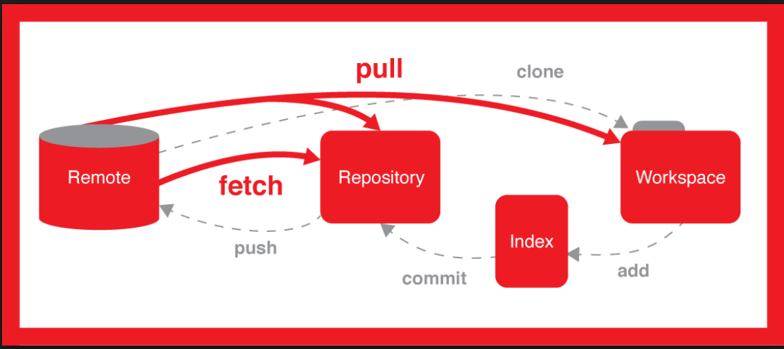

# GitQuickTools

## Download and configure Git

* sudo yum install -y git
* git config --global user.name "name"
* git config --global user.email "email"
* You can connect to github without user/password by using ssh keys for this first
    * create a ssh key on your local server `ssh-keygen -t rsa -b 4096`
    * This creates a pub and private key, copy the content of pub key `cat /home/user/.ssh/id_rsa.pub`
    * paste it in git settings ssh
    * if still asks for password use [following](https://unix.stackexchange.com/questions/36540/why-am-i-still-getting-a-password-prompt-with-ssh-with-public-key-authentication)

## To push a new repository/repo (folder) to a git repo

* on github.com create a new repo, copy the `.git` url
* cd to the folder
* git init
* git add *
* git status # make sure all files are added
* git commit -m `message`
* git remote add origin `.git` url
    * In case if you give an incorrect `url` use the following `git remote set-url origin .git`
* git push -u origin master

## Git branch

* You can start coding with the above, but it is best practice to create a seperate branch and push changes to it. 
* Git branches are simply different versions of code simultaneously
* This allows separate teams to work at the same time
* Branching interacts with CICD in such a way that some teams maintain a production branch and once a code is merged into production it initates automated process from build to deployment in production
* Branch can be created by below commands

* `git branch xyz` # creates a new branch
* `git checkout xyz` # moves branch from master to new xyz branch
    * or you can use `git checkout -b xyz` which will do above two steps
* after above you will do regular `git add *` and `git commit -m "message` this way you will save the work in branch and when done, you can save it in master
    * git log # to see all the commits
    * git rebase -i HEAD~x # to squash(remove) commmits, you will get 2 VI sessions, one for removing commit, and second for writing a combined commit log. x is for the number of commits you want to combine
* git checkout master
* git merge xyz
* git push origin master # to actually push the code to github.com
    * Instead of this we can push the branch directly by using the command `git push -u origin xyz` before we checkout

## git tag

* Targs are simply  a readable pointers to a particular commit. They are used to provide a name to reference a that commit in the future
## To push an existing repo

* cd to the folder
* git add *
* git status # make sure all files are added
* git commit -m `message`
* git push -u origin master

## To push a single file

* cd to the folder
* git add `filename`
* git status # make sure all files are added
* git commit -m `message`
* git push -u origin master

## setup git to point to a new github account

* cd to folder
* git init
* git config --global user.name `git user name`
* git config --global user.email `git account email`
* Go to Credential Manager
* Go to Windows Credentials
* Delete the entries under Generic Credentials

For more info on this

[Link - Windows](https://stackoverflow.com/questions/15381198/remove-credentials-from-git)

[Link - Mac](https://superuser.com/questions/1064197/how-to-switch-git-user-at-terminal)

## pull from a remote repo

* create a folder in your local system
* cd to folder
* git init
* git pull `url.git`

*Note:* When we have to push it back, we will have to use the following command as well `git remote add origin .git url`

## git pull vs git clone

* `git clone` is how you get a local copy of an existing repository to work on. It's usually only used once for a given repository, unless you want to have multiple working copies of it around. ... `git pull` (or `git fetch` + `git merge` ) is how you update that local copy with new commits from the remote repository

## git pull requests

* done for a branch to another branch using GUI
